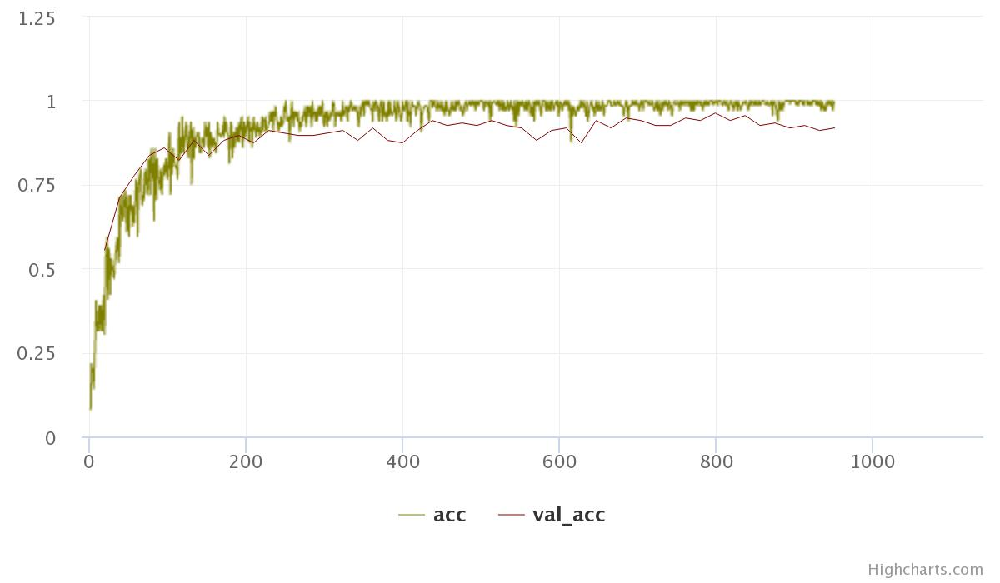
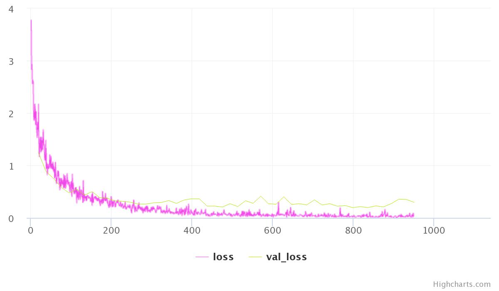

# Digit Recognition from Sound
#### A simple neural network (CNN) to classify spoken digits (0-9).
---

Dataset: <a href='https://github.com/Jakobovski/free-spoken-digit-dataset'>free-spoken-digit-dataset</a> (FSDD)

## Step 1 - Data Preprocessing

The data is provided as 50 audio samples (WAV files) of each digit per person, and 3 people have contributed to the official project.

Total data = 1500 audio samples in *.wav* format.

We split the data as 90% train - 10% test.

### Possible approaches to this problem -
* **Simple Neural Network** 

	1. Load the *wav* file as a NUMPY array, and feed this numpy array to a simple _multi-layer perceptron_.
	2. When we convert a WAV file to a NUMPY array, the data gets stored as a 1-D matrix. The length of this array is not specific, andit is highly dependent on the data.
	3. Due to this, the first layer of the MLP will have ~10000 neurons. Further calculations will add extreme complexity.

* **Spectrogram** 
	
	1. Convert the *wav* data into a spectrogram (image file) of size (64*64)
	2. Feed the image file to a simple Neural Network with 4096 neurons in the first layer.
	3. This is a good approach, but the number of neurons are large, and it does not seem logical to flatten out an image and feed it to a simple NN. We can do better.
	4. Based on point 3 above, we can feed this 64*64 image to a simple Convolutional Neural Network.
	5. Every audio willl be converted into a simple 2-D image, and this image will be fed to a CNN. This will speed up the training, and as CNNs are flawless in simple image recognition, we will definitely get a good output.
	

	 
	 
	<i>Spectrogram</i>

* **Mel-Frequency Cepstrum Coefficient** 
	Here's what <a href='https://en.wikipedia.org/wiki/Mel-frequency_cepstrum'>Wikipedia</a> has to say about MFCC -  
	*In sound processing, the mel-frequency cepstrum (MFC) is a representation of the short-term power spectrum of a sound, based on a linear cosine transform of a log power spectrum on a nonlinear mel scale of frequency
	Mel-frequency cepstral coefficients (MFCCs) are coefficients that collectively make up an MFC. They are derived from a type of cepstral representation of the audio clip (a nonlinear "spectrum-of-a-spectrum"). The difference between the cepstrum and the mel-frequency cepstrum is that in the MFC, the frequency bands are equally spaced on the mel scale, which approximates the human auditory system's response more closely than the linearly-spaced frequency bands used in the normal cepstrum. This frequency warping can allow for better representation of sound, for example, in audio compression.*
	
	1. MFCC is a better representation of sound. And it can be treated like an image for all practical purposes for training.
	2. Thus, I think using the MFCC representation of the WAV files is the best approach.
	
**We move forward with the MFCC approach**

## Step 2 - Model Building

We use **Keras** for the model building. 

* **Model Hyperparameters** 
	1. Optimizer - Adadelta 
	2. Activation - ReLU 
	3. Number of epochs - 50 
	4. Batch Size - 64 
	5. Learning rate - Adadelta default 
	6. Loss - Categorical Crossentropy
	
* **Model Structure** 
	1. 3 convolutional layers
	2. 1 Max Pooling Layer
	3. 3 dense layers (MLP)
	4. Softmax Activation for output
	5. BatchNormalization Layer after every Conv Layer and Dense Layer.
	6. Dropout for every layer of MLP.

## Step 3 - Training

* **Accuracy** 

	 
	 
	<i>Model Accuracy</i>

* **Loss** 

	 
	 
	<i>Model Loss</i>

**We get 98% validation accuracy!**

## Step 4 - Test

We use the test data to check the model performance on new data. Based on the results, we get 97% accuracy!

             precision    recall  f1-score   support

          0       1.00      0.84      0.91        19
          1       0.87      0.87      0.87        15
          2       1.00      1.00      1.00        23
          3       0.91      1.00      0.95        10
          4       1.00      1.00      1.00        10
          5       1.00      1.00      1.00        23
          6       1.00      1.00      1.00        13
          7       0.93      1.00      0.96        13
          8       1.00      1.00      1.00        14
          9       0.91      1.00      0.95        10

	avg / total       0.97      0.97      0.97       150
	

Thus, we have trained a Neural Network to correctly classify spoken digits.
